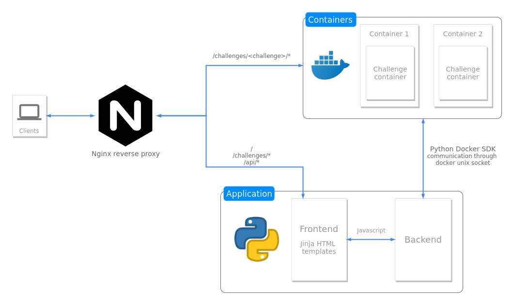

* [Architecture](#architecture)
* [Recommended hardware requirements](#recommended-hardware-requirements)
* [Installation](#installation)

Architecture
===


Recommended hardware requirements
===
* 8 VCPUs
* 8GB RAM
* 64GB disk

Installation
===========
* install and setup nginx
  * `/etc/nginx/nginx.conf`
    ```
    user www-data;
    worker_processes auto;
    pid /run/nginx.pid;
    include /etc/nginx/modules-enabled/*.conf;
    
    events {
        worker_connections 768;
    }
    
    http {
        sendfile on;
        tcp_nopush on;
        tcp_nodelay on;
        keepalive_timeout 65;
        types_hash_max_size 2048;
        include /etc/nginx/mime.types;
        default_type application/octet-stream;
        ssl_prefer_server_ciphers on;
        access_log /var/log/nginx/access.log;
        error_log /var/log/nginx/error.log;
        gzip on;
        include /etc/nginx/conf.d/*.conf;
        include /etc/nginx/sites-enabled/*.conf;
    }
    ```
  * `/etc/nginx/sites-enabled/container-escape.conf`
    ```
    server {
        listen 80;
        include /etc/nginx/sites-enabled/containers/*;
        
        location / {
            proxy_pass http://127.0.0.1:5000/;
            proxy_set_header X-Real-IP $remote_addr;
        }
    }
    ```
  * `mkdir /etc/nginx/sites-enabled/containers/`
* install docker
  * ~~install gVisor sandbox~~ (gVisor is not cooperating with dind docker image, until problem is solved, skip this step)
    * ~~download gVisor binary~~
      ```bash
      $ wget https://storage.googleapis.com/gvisor/releases/master/latest/runsc -O /home/user/runsc
      $ chmod +x /home/user/runsc
      ```
    * ~~`/etc/docker/daemon.json`~~
      ```json
      {
          "runtimes": {
              "runsc": {
                  "path": "/home/user/runsc"
              }
          },
          "default-runtime": "runsc"
      }
      ```
    * ~~restart docker~~
      ```bash
      $ sudo systemctl restart docker
      ```  
* systemd service
  * `/etc/systemd/system/container-escape.service`
    ```
    [Unit]
    Description=Container Escape project service
    
    [Service]
    Type=simple
    ExecStart=/opt/container-escape/venv/bin/python /opt/container-escape/src/main.py
    WorkingDirectory=/opt/container-escape/src/
    
    [Install]
    WantedBy=multi-user.target
    ```
